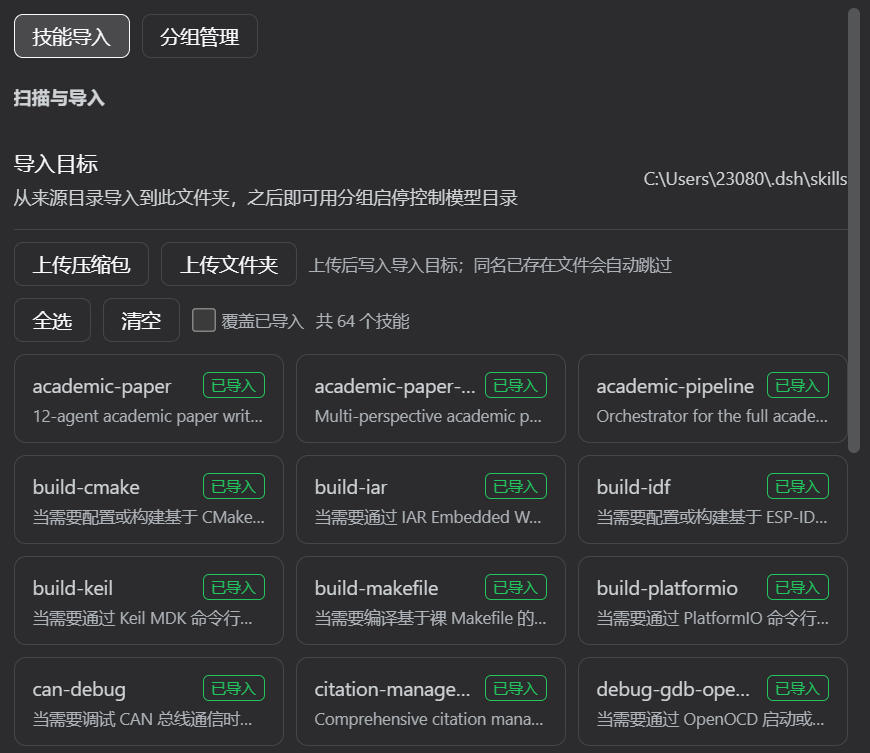
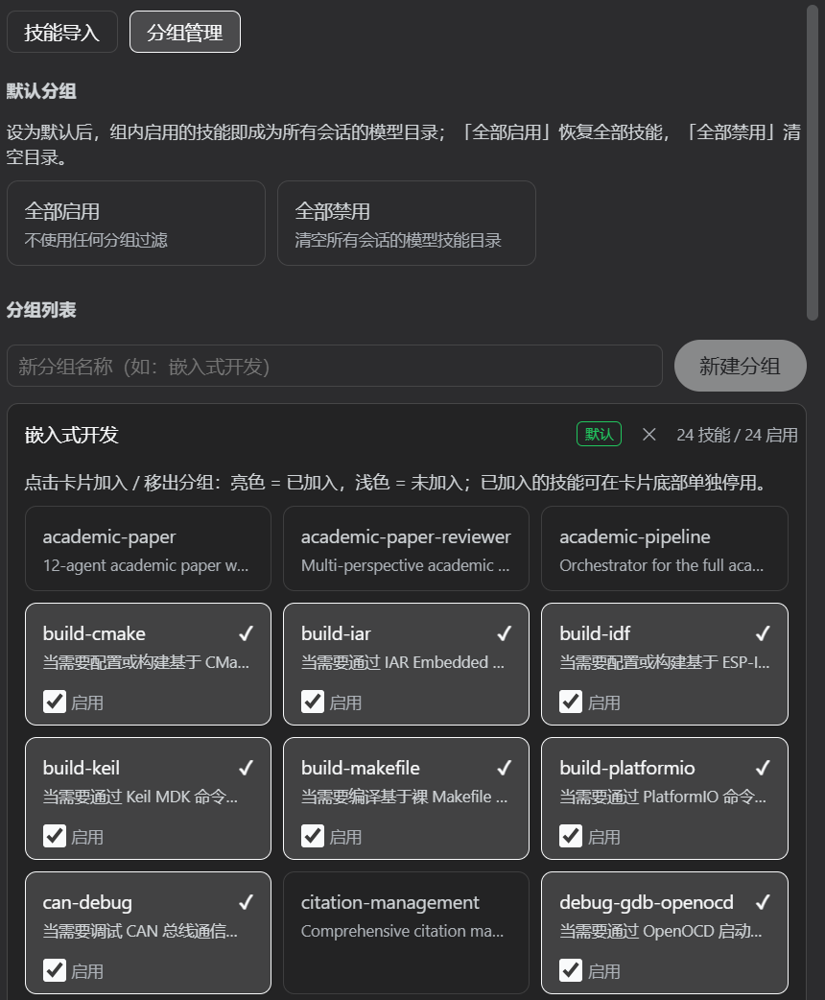
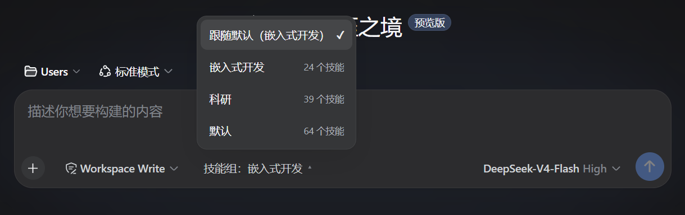

<div align="center">

# DSH Skill Manager

**A skill-manager plugin for DeepSeek Harness (DSH)**

Scan official skill roots · one-click import / upload · group enable & disable (atomic `SKILL.md` rename) · default group + per-session picker · all-Chinese web UI

[](LICENSE)
[](https://github.com/Mvyvn/dsh-skill-manager/releases)
[](https://nodejs.org)
[]()

</div>

---

## What is this?

DSH Skill Manager is a **real web-profile plugin** (not a temporary dynamic plugin): it loads automatically with every `dsh web` start and needs no approval. It turns DSH's model skill catalog into a manageable state:

- **Scan** — list every skill under `~/.agents/skills`, `$DSH_HOME/skills`, etc. (name, description, imported?, disabled?);
- **Import / upload** — copy skills into `$DSH_HOME/skills` (DSH loads it with higher priority than `~/.agents/skills`) with one click, or upload a `.zip` archive / a whole folder straight from the browser;
- **Group enable & disable** — create groups, assign skills, toggle per-skill enablement; switching the active group immediately rebuilds the model skill catalog for every session;
- **Default group** — pick the group that shapes every session's catalog; supports "all enabled" and "all disabled";
- **Per-session picker** — a group dropdown at the left of the conversation input bar for per-session overrides.

> Enable/disable no longer rewrites file content: it **atomically renames** `SKILL.md` → `SKILL.md.disable`. Zero content writes, 1–2 native fs ops per skill, safe under concurrent sessions. See [docs/how-it-works.md](docs/how-it-works.md).

## Screenshots

> ⚠️ Placeholders — to be replaced.

| Settings · Skill 管理 (Import) | Group management (default group) | Input-bar group picker |
| :---: | :---: | :---: |
|  |  |  |

## Features

- ✅ Scan official skill roots with dedupe (import-target state wins)
- ✅ One-click import / browser upload of zip or folder (hidden/system files skipped; >500 files or >16MB content blocked)
- ✅ Groups: create, assign, per-skill disable, delete; deleting the default group falls back to "all enabled"
- ✅ Default group shapes every session's catalog; reserved id `__all_off__` = all disabled
- ✅ Session-scoped group picker in the input bar (follow default / pick a group)
- ✅ **Atomic rename enable/disable**: `SKILL.md` ↔ `SKILL.md.disable`, no content writes
- ✅ **Cross-process config lock** (`skill-mgmt.json.lock`) — safe with concurrent dsh sessions
- ✅ `skillmg_*` model tools — the AI can manage skills on its own
- ✅ Auto-maintained companion skill `skill-grouping` (recreated on boot when missing)
- ✅ All-Chinese UI with official DSH theme tokens
- ✅ Real plugin install: loads on every `dsh web` start, no approval needed

## Installation

Prerequisite: DSH installed and `dsh web` started at least once (a web profile must exist).

### Option 1: One-liner script (recommended)

```powershell
# Windows (PowerShell)
git clone https://github.com/Mvyvn/dsh-skill-manager.git
cd dsh-skill-manager
powershell -ExecutionPolicy Bypass -File scripts/install.ps1
```

```bash
# macOS / Linux
git clone https://github.com/Mvyvn/dsh-skill-manager.git
cd dsh-skill-manager
bash scripts/install.sh
```

The script installs the plugin into `$DSH_HOME/profiles/web/node_modules/dsh-skill-manager/` (`$DSH_HOME` defaults to `~/.dsh`), then **fully restart `dsh web`** (stop and start the process — a page refresh is not enough).

### Option 2: Manual install

1. Copy `lib/`, `cordis.patch.yml` and `package.json` from this repo into `$DSH_HOME/profiles/web/node_modules/dsh-skill-manager/`;
2. Fully restart `dsh web`.

### Verify

- Settings shows a new "Skill 管理" section and the skill list loads;
- A "技能组：" dropdown appears at the left of the input bar;
- Full checklist: [docs/getting-started.md](docs/getting-started.md).

## Quick start

1. Open **Settings → Skill 管理 → 技能导入**, check the skills you want and click 导入所选;
2. Switch to **分组管理**: create a group (e.g. 嵌入式开发), expand its card and assign skills;
3. Click 设为默认 — every session's catalog switches immediately;
4. Use the input-bar dropdown for a per-session override;
5. Want the AI to manage it? Just ask: "把 xxx 技能分到 xxx 组" — it uses the `skillmg_*` tools.

## Configuration

Everything lives in `$DSH_HOME/skill-mgmt.json` (writes guarded by a cross-process lock):

| Field | Meaning |
| --- | --- |
| `sourceDirs` | Skill source directories to scan (default `~/.agents/skills`, `$DSH_HOME/skills`) |
| `importTarget` | Import target (default `$DSH_HOME/skills`) |
| `groups` | Group array: `{id, name, skills: [{name, enabled}]}` |
| `defaultGroup` | Default group id; `null` = all enabled; `__all_off__` = all disabled |
| `perSessionGroups` | Per-session overrides (recorded only; the catalog is still shaped by the default group) |
| `disabled` | Currently disabled skills (dirName → true) |

## AI-driven management (`skillmg_*` tools)

| Tool | Purpose |
| --- | --- |
| `skillmg_get_config` | Show config: source dirs, import target, default group, groups, disabled count |
| `skillmg_scan` | List every available skill and its state |
| `skillmg_import` | Import skills (`overwrite` supported) |
| `skillmg_list_groups` / `skillmg_create_group` / `skillmg_delete_group` | Group management |
| `skillmg_update_group` | Set group members and enablement |
| `skillmg_set_default_group` | Set the default group (empty = all enabled, `__all_off__` = all disabled) |
| `skillmg_set_session_group` / `skillmg_get_session` | Per-session group override |
| `skillmg_debug_catalog` | Runtime skill catalog snapshot (diagnostics) |

## Project layout

```
dsh-skill-manager/
├── lib/
│   ├── index.js          # Host: RPC channel /skillmg + skillmg_* tools + sync
│   └── client.js         # Browser: hand-written __ModuleLoader__ bundle (no build step)
├── skills/
│   └── skill-grouping/   # Auto-maintained companion skill
├── scripts/
│   ├── install.ps1       # Windows installer
│   └── install.sh        # macOS/Linux installer
├── docs/                 # Documentation (architecture, how-it-works, getting-started)
├── screenshots/          # Screenshots (placeholders)
├── cordis.patch.yml      # Web-profile plugin mount patch
└── package.json
```

## How it works

1. DSH skill discovery (`dsh-skill-filesystem`) **only recognizes the exact filename `SKILL.md`**;
2. Disable = atomically rename `SKILL.md` → `SKILL.md.disable`, and the skill vanishes from the model catalog; enable = rename back (and strip any legacy `disable-model-invocation` marker);
3. Every config write holds a cross-process exclusive lock, safe under concurrent sessions.

Details: [docs/how-it-works.md](docs/how-it-works.md) and [docs/architecture.md](docs/architecture.md).

## Compatibility & limitations

- Relies on DSH (rc series) discovering only the exact filename `SKILL.md`; if that changes upstream, fall back to the `disable-model-invocation` field scheme (the code is compatible and cleans up legacy markers on enable).
- Per-session overrides (`perSessionGroups`) are recorded but not yet rendered into the catalog (the default group decides).
- Developed and tested mainly on Windows; macOS/Linux paths use `~` / `$DSH_HOME` semantics — feedback welcome.
- Browser upload supports text files only (the SKILL.md scenario), ≤2MB per file, ≤16MB total.

## License

[MIT](LICENSE) © 2026 沐云 (Mvyvn)
